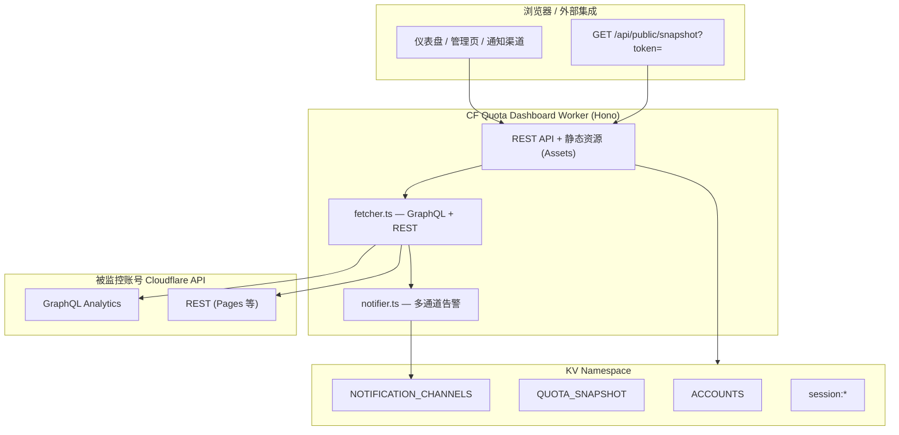

# CF Quota Dashboard

Cloudflare **Workers 免费套餐**多账号额度监控面板。只需在**一个** Cloudflare 账号上部署 Worker；被监控的账号通过 KV 动态添加，无需在 `wrangler.toml` 中为每个账号配置 `[env]`。

> 灵感参考：[UsagePanel](https://github.com/Cloudflare-MrWang/UsagePanel) 等社区额度监控方案。本项目采用单 Worker + KV 多账号架构，并扩展了通知渠道、管理认证与刷新预算控制。

## 功能特性

- **多账号 KV 管理**：添加 / 编辑 / 删除 / 启用 / 禁用；保存前 **Verify Credentials** 验证 Token
- **28 项免费额度指标**（27 项可 API 采集），含 `pages_requests`（Pages Functions 日请求）
- **跨账号汇总**：仪表盘顶部聚合 Workers、Pages、D1、KV、R2、AI 等用量及 ≥ 阈值告警列表
- **多通道告警**（`/channels`）：企业微信、飞书、钉钉、Webhook、Telegram、Email
- **告警测试**：`/channels` 或 `/admin` 一键发送测试告警，逐渠道显示成功/失败（每分钟限 1 次）
- **按账号告警配置**（`/admin` 编辑账号）：按服务（Workers、D1、KV、R2 等）勾选并设置阈值百分比；**默认不启用**，需手动配置
- **访问触发刷新**：打开仪表盘或调用 `GET /api/snapshot` 时，若缓存超过配置的刷新间隔则自动拉取
- **6 小时 Cron 兜底**：`0 */6 * * *` 定时刷新，无人访问时仍更新配额（尊重每账号缓存间隔）
- **账号变更刷新**：添加 / 删除 / 启用 / 禁用账号后立即触发一次刷新
- **刷新预算**：每账号约 **10** 次 subrequest（`SUBREQUESTS_PER_ACCOUNT = 10`），单次最多 **50**；响应含 `refreshStats`
- **管理认证**：`PASSWORD` / `USERNAME`，`/login` 登录；未设置 `PASSWORD` 时为 **Dev 模式**
- **公开 API**：`GET /api/public/snapshot?token=` 供外部集成
- **UI**：Glassmorphism 毛玻璃风格，右下角 **明/暗主题切换**（`localStorage` 持久化，首次访问跟随系统偏好）
- **GitHub Actions**：推送到 `master` 自动部署

## 架构



```
┌──────────────┐   GET /api/snapshot     ┌─────────────────────┐
│ Hono Worker  │ ── (过期时自动拉取) ──► │ 各账号 CF GraphQL   │
│ (单次部署)    │   + Cron 每 6h 兜底     │ + REST API          │
└──────┬───────┘   + POST /cron/fetch ↻  └─────────────────────┘
       │           + 账号变更后刷新
       │
       ▼
  KV: ACCOUNTS · QUOTA_SNAPSHOT · NOTIFICATION_CHANNELS · session:*
       │
       ▼
  frontend/ (Assets) — index · admin · channels · login
```

## 本地预览

### 前置条件

- [Node.js](https://nodejs.org/) 18+
- Cloudflare 账号（本地 dev 也需要 KV binding，wrangler 会使用远程 KV 或本地模拟）

### 步骤

```powershell
cd e:\code\CF-Quota-Dashboard\worker
npm install
```

在 `worker/` 目录创建 `.dev.vars`（已被 `.gitignore` 忽略，**勿提交**）：

```env
PASSWORD=your-local-dev-password
# 可选
# USERNAME=admin
# WEBHOOK_URL=https://...
```

```powershell
npm run dev
```

浏览器访问 **http://localhost:8787**。

| 场景 | 行为 |
|------|------|
| **未设置 `PASSWORD`** | Dev 模式：写操作（增删账号、渠道、手动刷新）无需登录；导航栏显示 `Dev mode` |
| **设置了 `PASSWORD`** | 访问 `/admin`、`/channels` 及写 API 需先登录 `/login` |
| **主题** | 右下角太阳/月亮按钮切换明/暗色，偏好保存在浏览器 |

> 本地开发前请先在 `wrangler.toml` 中填入有效的 KV namespace `id`（见下方生产部署步骤 1）。

## 生产部署

### 1. 前置条件

- Cloudflare 账号（**托管 Worker 的账号**，与被监控账号可以不同）
- [Wrangler CLI](https://developers.cloudflare.com/workers/wrangler/)（项目已包含在 `worker` 依赖中）
- 为每个被监控账号准备 **只读 API Token**（见 [API Token 权限](#api-token-权限)）

### 2. 创建 KV 命名空间

```powershell
cd e:\code\CF-Quota-Dashboard\worker
npx wrangler kv namespace create KV
```

将输出中的 `id` 写入 `worker/wrangler.toml`：

```toml
[[kv_namespaces]]
binding = "KV"
id = "<your-kv-namespace-id>"
```

### 3. 设置 Secret

**必须**（生产环境）：

```powershell
npx wrangler secret put PASSWORD
# 按提示输入管理员密码
```

**可选**：

```powershell
npx wrangler secret put PUBLIC_API_TOKEN
# 自定义公开 API token；不设置则从 PASSWORD+USERNAME 派生 HMAC
```

> Secret 无法写在 `wrangler.toml` 的 `[vars]` 中，必须通过 `wrangler secret put` 或 Cloudflare Dashboard 配置。

### 4. 配置环境变量

编辑 `worker/wrangler.toml` 的 `[vars]` 段：

```toml
[vars]
WEBHOOK_URL = ""                    # 可选：无 KV 渠道时的旧版企微 webhook 回退
ALERT_THRESHOLD = "70"              # 告警阈值（百分比）
USERNAME = "admin"                  # 登录用户名
ACCOUNT_CHECK_INTERVAL_MINUTES = "20"
MAX_EXTERNAL_SUBREQUESTS_PER_RUN = "50"
# FREE_TIER_LIMITS = '{"workers_requests":{"limit":100000}}'  # 可选 JSON 覆盖
# PUBLIC_API_TOKEN = ""             # 也可用 secret 设置
```

### 5. 部署

```powershell
cd e:\code\CF-Quota-Dashboard\worker
npm install
npm run typecheck
npx wrangler deploy
```

部署成功后终端会输出 Worker URL，例如 `https://cf-quota-dashboard.<subdomain>.workers.dev`。

### 6. 首次使用

1. 打开 Worker URL → 仪表盘（`/`）
2. 若已设置 `PASSWORD` → 访问 **账号管理**（`/admin`）会跳转 `/login` 登录
3. **添加被监控账号**：Account Name、Account ID、只读 API Token → **Verify Credentials** → **Save**
4. **配置通知渠道**（`/channels`）：添加渠道 → **测试** → 启用
5. 打开仪表盘即可触发首次拉取；缓存过期后再次访问会自动更新；也可点击 ↻ 强制手动刷新

### 刷新间隔（管理后台）

在 **账号管理**（`/admin`）顶部的 **刷新设置** 中可配置缓存 TTL（默认 **20 分钟**），保存至 KV `DASHBOARD_CONFIG`。当 `GET /api/snapshot`（或公开 API）被访问且快照 `lastUpdated` 超过该间隔时，Worker 会触发一次配额拉取并返回最新数据；仪表盘打开期间也会按此间隔轮询 snapshot（仅过期时才真正调用 Cloudflare API）。

**两种自动刷新机制**：

| 机制 | 触发条件 | `force` | 说明 |
|------|----------|---------|------|
| 访问触发 | `GET /api/snapshot` / 公开 API，快照过期 | `true` | 用户打开仪表盘或外部集成拉取时立即刷新 |
| Cron 兜底 | `0 */6 * * *`（每 6 小时） | `false` | 长期无人访问时仍更新；尊重每账号 `lastCheckTime` 与刷新间隔 |
| 账号变更 | 添加 / 删除 / 启用 / 禁用账号 | `true` | 配置变更后立即拉取 |

Cron 与访问触发共用 `runQuotaFetch` 与 subrequest 预算；Cron 不会强制跳过 per-account 缓存，避免频繁调用 Cloudflare API。

### 按账号告警配置

在 **账号管理**（`/admin`）添加或编辑账号时，**告警设置**区域可按服务启用推送：

- 每行一个服务（Workers、Pages、D1、KV、R2、Vectorize、Browser Run 等）
- 勾选启用 + 设置阈值百分比（默认 **80%**）
- 仅对已启用账号、且勾选了的服务下各指标生效；`metric.pct ≥ thresholdPercent` 且 `available: true` 时触发

配置保存在 KV `ACCOUNTS` 的 `alertRules` 数组（`metricKey`、`enabled`、`thresholdPercent`），经 `POST/PUT /api/accounts` 更新。服务分组列表见 `GET /api/alert-service-groups`。

旧版 `alerts` 字段会在读取时自动迁移为 `alertRules`。未配置 `alertRules` 的账号**不会**触发推送（仪表盘内联 ≥70% 提示不受影响）。

推送去重（UTC 日历周期，KV `ALERT_COOLDOWN`，键 `accountId:metricKey`）：

- **日配额指标**（`period: daily`，含 `total` 容量类）：同一账号同一指标 **每个 UTC 日最多推送一次**
- **月配额指标**（`period: monthly`）：同一账号同一指标 **每个 UTC 月最多推送一次**
- 同一周期内若用量百分比 **超过** 上次告警时的值仍会再次推送（例如从 82% 升至 88%）

### 7. 可选：KV 预置测试账号

```powershell
npx wrangler kv key put --binding=KV ACCOUNTS "[{\"id\":\"test-1\",\"name\":\"Test\",\"accountId\":\"YOUR_ACCOUNT_ID\",\"apiToken\":\"YOUR_TOKEN\",\"enabled\":true}]"
```

手动触发抓取（已配置 `PASSWORD` 时需先登录并带 Cookie，或使用 Dev 模式）：

```powershell
curl.exe -X POST "https://your-worker.workers.dev/cron/fetch" -H "Cookie: cfqd_session=..."
```

## 环境变量

| 变量 | 类型 | 默认值 | 说明 |
|------|------|--------|------|
| `PASSWORD` | Secret | *(空)* | 管理员密码。**未设置 = Dev 模式**，写 API 无需认证 |
| `USERNAME` | Var | `admin` | 登录用户名 |
| `ALERT_THRESHOLD` | Var | `70` | 规范化告警规则时的阈值回退值；**不再**对未配置账号全局自动告警 |
| `FREE_TIER_LIMITS` | Var | 内置默认 | JSON 覆盖 `worker/src/free-tier-limits.ts` 中的限额 |
| `WEBHOOK_URL` | Var | *(空)* | 旧版单 webhook；**仅当 KV 无 `NOTIFICATION_CHANNELS` 时**作为隐式企微渠道 |
| `ACCOUNT_CHECK_INTERVAL_MINUTES` | Var | `20` | 未在 KV 配置刷新间隔时的回退值（快照缓存 TTL） |
| `MAX_EXTERNAL_SUBREQUESTS_PER_RUN` | Var | `50`（上限 50） | 单次刷新最多对外 subrequest 数（Workers 单次调用上限 50） |
| `PUBLIC_API_TOKEN` | Secret/Var | HMAC 派生 | `GET /api/public/snapshot?token=` 的鉴权 token |

## API 路由

| 方法 | 路径 | 认证 | 说明 |
|------|------|------|------|
| GET | `/` | — | 仪表盘 |
| GET | `/admin` | 页面需登录* | 账号管理 |
| GET | `/channels` | 页面需登录* | 通知渠道管理 |
| GET | `/login` | — | 登录页 |
| GET | `/api/me` | — | 会话状态；Dev 模式返回 `devMode: true` |
| POST | `/api/login` | — | 登录，设置 `cfqd_session` Cookie（24h，KV） |
| POST | `/api/logout` | — | 登出 |
| GET | `/api/snapshot` | — | 最新配额快照；缓存过期时自动触发刷新 |
| GET | `/api/config` | — | 仪表盘刷新间隔等配置 |
| PUT | `/api/config` | 需登录† | 更新刷新间隔（KV） |
| GET | `/api/public/snapshot?token=` | Token | 公开快照（外部集成）；缓存过期时自动触发刷新 |
| GET | `/api/public/token` | 需登录 | 查看/派生公开 API token |
| GET | `/api/accounts` | — | 账号列表（Token 掩码） |
| POST | `/api/accounts` | 需登录† | 添加账号 |
| POST | `/api/accounts/verify` | 需登录† | 验证 Account ID + Token |
| PUT | `/api/accounts/:id` | 需登录† | 更新名称 / Token / 启用状态 |
| DELETE | `/api/accounts/:id` | 需登录† | 删除账号 |
| GET | `/api/channels` | — | 渠道列表（敏感字段掩码） |
| POST | `/api/channels` | 需登录† | 添加渠道 |
| PUT | `/api/channels/:id` | 需登录† | 更新渠道 |
| DELETE | `/api/channels/:id` | 需登录† | 删除渠道 |
| PATCH | `/api/channels/:id/toggle` | 需登录† | 启用/禁用切换 |
| POST | `/api/channels/:id/test` | 需登录† | 向单个渠道发送测试消息 |
| POST | `/api/alerts/test` | 需登录† | 向所有已启用渠道发送测试告警；可选 body `{ "accountId": "..." }` 附带账号名；429 限频 1 次/10 秒（按会话） |
| POST | `/cron/fetch` | 需登录† | 强制手动刷新；响应含 `refreshStats` |

\* 页面级：`authEnabled && !authenticated` 时前端重定向 `/login`。  
† API 级：未配置 `PASSWORD` 时 `requireAuth` 直接放行（Dev 模式）。

### 刷新预算响应示例

```json
{
  "lastUpdated": "2026-07-03T12:00:00.000Z",
  "accounts": [ "..." ],
  "refreshStats": {
    "refreshed": 2,
    "failed": 0,
    "cached": 1,
    "skippedByLimit": 0,
    "subrequestsUsed": 10
  },
  "alerted": false
}
```

每个账号约消耗 **10** 次 subrequest（`SUBREQUESTS_PER_ACCOUNT = 10`），单次最多刷新约 5 个账号（50 ÷ 10）。

## 通知渠道配置

在 **`/channels`**（通知渠道管理）添加。KV key：`NOTIFICATION_CHANNELS`。  
当 KV 中存在渠道时，**优先于** `WEBHOOK_URL`；KV 为空且设置了 `WEBHOOK_URL` 时，告警仍走隐式企微渠道（不在 UI 显示）。

| 类型 | 配置字段 | 说明 |
|------|----------|------|
| **wecom** 企业微信 | `webhookUrl` | 群机器人 Webhook，Markdown 消息 |
| **feishu** 飞书 | `webhookUrl` | 群机器人 Webhook，纯文本 |
| **dingtalk** 钉钉 | `webhookUrl` | 自定义机器人 Webhook，Markdown |
| **webhook** | `webhookUrl`，可选 `customHeaders`（JSON） | 通用 JSON：`title`、`content`、`markdown`、`alerts[]` |
| **telegram** | `botToken`，`chatId` | Telegram Bot API `sendMessage` |
| **email** | `to`，`webhookUrl` | HTTP 邮件中继（Resend、Mailgun、自建 API）；Workers **不支持 SMTP** |

各渠道支持：**测试发送**、**启用/禁用**、API 返回敏感字段掩码（`first4...last4`）。

在 **`/channels`** 点击「发送测试告警」，或在 **`/admin`** 告警设置区点击同名按钮，可向所有已启用渠道推送测试消息；编辑账号时会附带该账号名称作为示例。测试消息标题为 `【测试告警】CF 配额监控测试消息`，正文含一条模拟 Workers Requests 用量行，便于对照真实告警格式。

### Webhook  payload 示例

```json
{
  "title": "CF Quota Alert (≥70%)",
  "content": "...",
  "markdown": "...",
  "threshold": 70,
  "alerts": [
    { "account": "主账号", "label": "Workers Requests", "used": 80000, "limit": 100000, "pct": 80, "unit": "requests", "period": "daily" }
  ]
}
```

## GitHub Actions CI/CD

工作流：`.github/workflows/deploy.yml`  
触发：`push` 到 `master`，或手动 `workflow_dispatch`。

### 所需 Repository Secrets

| Secret | 说明 |
|--------|------|
| `CLOUDFLARE_API_TOKEN` | 托管账号的 API Token，需 **Workers 部署** 权限 |
| `CLOUDFLARE_ACCOUNT_ID` | 托管 Worker 的 Account ID |
| `KV_NAMESPACE_ID` | *(可选)* KV 命名空间 ID；未设置时 CI 会自动查找名为 `KV` 的命名空间，不存在则创建 |

### 流程

1. `npm ci`（在 `worker/`）
2. `npm run typecheck`
3. `npx wrangler deploy`

> **注意**：GitHub Actions **不会**自动设置 `PASSWORD` 等 Worker Secret。首次 CI 部署后，仍需在本地或 Dashboard 执行 `wrangler secret put PASSWORD`。CI 会在部署前自动解析 KV 命名空间（优先使用 `KV_NAMESPACE_ID` secret，否则查找或创建名为 `KV` 的命名空间）；本地部署仍需在 `wrangler.toml` 中填入有效 `id`。

## 免费额度默认值

定义于 `worker/src/free-tier-limits.ts`，可通过 `FREE_TIER_LIMITS` 环境变量（JSON）覆盖。

| 指标 | 免费上限 | 周期 |
|------|----------|------|
| Workers 请求 | 100,000 | 日 (UTC) |
| Pages 构建 | 500 | 月 |
| Pages Functions 请求 | 100,000 | 日 |
| D1 读/写行 | 5,000,000 / 100,000 | 日 |
| D1 存储 | 5 GB | 总量 |
| KV 读/写/删/列 | 100,000 / 1,000 ×3 | 日 |
| KV 存储 | 1 GB | 总量 |
| R2 存储 | 10 GB | 月 |
| R2 Class A / B | 1,000,000 / 10,000,000 | 月 |
| Workers AI neurons | 10,000 | 日 |
| Queues 操作 | 10,000 | 日 |
| Vectorize 查询/存储维度 | 30M / 5M | 月 / 总量 |
| Hyperdrive 查询 | 100,000 | 日 |
| Workflows 调用 | 100,000 | 日 |
| Durable Objects 请求/时长/读写/SQL | 100k / 13k GB-s / 5M·100k / 5 GB | 见代码 |
| Browser Run | 10 分钟 | 日 |
| Analytics Engine 写入 | 100,000 points | 日 |

参考：[Workers 定价](https://developers.cloudflare.com/workers/platform/pricing/)、[D1](https://developers.cloudflare.com/d1/platform/pricing/)、[R2](https://developers.cloudflare.com/r2/pricing/)、[Pages 限制](https://developers.cloudflare.com/pages/platform/limits/)。

## 指标 API 覆盖

### 可采集（GraphQL / REST）

| 服务 | 指标 | API |
|------|------|-----|
| Workers | 请求数 | `workersInvocationsAdaptive` |
| D1 | 读/写行、存储 | `d1AnalyticsAdaptiveGroups`、`d1StorageAdaptiveGroups` |
| D1 | 数据库个数 | REST `/accounts/{id}/d1/database`（需 **Account → D1 → Read**；读/写/存储 GraphQL 仅需 Account Analytics: Read） |
| KV | 读/写/删/列、存储 | `kvOperationsAdaptiveGroups`、`kvStorageAdaptiveGroups` |
| R2 | 存储、Class A/B | `r2StorageAdaptiveGroups`、`r2OperationsAdaptiveGroups` |
| Pages | 月构建、Functions 日请求 | REST `/pages/projects` + `/deployments`；GraphQL `pagesFunctionsInvocationsAdaptiveGroups` |
| Workers AI | Neurons | `aiInferenceAdaptiveGroups` |
| Queues | 计费操作 | `queueMessageOperationsAdaptiveGroups` |
| Vectorize | 查询/存储维度 | `vectorizeV2QueriesAdaptiveGroups`（`sum { queriedVectorDimensions }`）、`vectorizeV2StorageAdaptiveGroups`（`max { storedVectorDimensions }`）；V1 回退 `vectorizeQueriesAdaptiveGroups` / `vectorizeStorageAdaptiveGroups` |
| Hyperdrive | 查询 | `hyperdriveQueriesAdaptiveGroups` |
| Workflows | 调用 | `workflowsAdaptiveGroups` |
| Durable Objects | 请求、时长、读写、SQL 存储 | `durableObjects*Groups` |
| Browser Run | 会话分钟 | `browserRenderingBrowserTimeUsageAdaptiveGroups` |
| Analytics Engine | 写入点数 | `workersAnalyticsEngineAdaptiveGroups` |

### 部分可用 / 不可用

| 服务 | 状态 |
|------|------|
| Workers CPU 时间 (10 ms) | 仅单次分位数，无账户级日累计 |
| Workers Logs 事件数 (200k/天) | 仅采集 **bytes**（`logExplorerIngestionAdaptiveGroups`），`workers_logs_bytes` 标记 `available: false`，不参与告警 |
| Analytics Engine 读查询 (10k/天) | GraphQL 无读计数 |
| Email Routing / Email Sending | 免费套餐无用量 API，需手动关注 |
| Workers subrequests (50/次调用) | 无账户级日配额 API |

## API Token 权限

在 Cloudflare Dashboard → **My Profile** → **API Tokens** → **Create Token** → **Create Custom Token** 中，为**被监控账号**创建 **只读** Token。

**最低必需权限**（缺一不可）：

- **Account → Account Analytics → Read** — 大部分 GraphQL 用量（Workers、D1 读/写/存储、KV、R2、Workflows、Browser Run 等）
- **Account → D1 → Read** — REST `GET /accounts/{id}/d1/database` 查询 D1 **数据库个数**（GraphQL 无法获取此项；缺此权限时 D1 卡片会显示权限提示，不影响 D1 读/写/存储用量）

**建议一并勾选**（按需）：

- Cloudflare Pages: Read
- Workers Scripts: Read
- Workers KV Storage: Read
- Workers R2 Storage: Read
- Queues: Read
- Hyperdrive: Read（若使用）
- Vectorize: Read（可选；仅在使用 REST 列举索引时，GraphQL 方式不需要）
- Account Settings: Read（可选，用于 Verify 显示账号名）

## 安全说明

1. **生产环境必须设置 `PASSWORD`**。未设置时所有写 API 对公网开放（Dev 模式）。
2. 被监控账号的 API Token 存于 KV；API 响应仅返回掩码（`abcd...wxyz`）。
3. Session：`cfqd_session` HttpOnly + Secure + SameSite=Strict，24 小时 TTL，存 KV `session:*`。
4. 公开快照 API 需 `token` 参数；token 默认为 `PASSWORD`+`USERNAME` 的 HMAC，或通过 `PUBLIC_API_TOKEN` 显式指定。
5. 告警只针对 `available: true` 的指标；不可用指标不会误报。
6. **托管 Worker 的** `CLOUDFLARE_API_TOKEN`（CI 用）与被监控账号 Token 职责分离，勿混用。

## 项目结构

```
CF-Quota-Dashboard/
├── worker/
│   ├── src/
│   │   ├── index.ts           # Hono 路由 + Cron 入口
│   │   ├── auth.ts            # 登录 / Session / 公开 API token
│   │   ├── kv-store.ts        # ACCOUNTS / SNAPSHOT / CHANNELS
│   │   ├── fetcher.ts         # GraphQL + REST 抓取
│   │   ├── calculator.ts
│   │   ├── notifier.ts        # 告警聚合 + 多渠道发送
│   │   ├── channels/          # wecom · feishu · dingtalk · webhook · telegram · email
│   │   ├── free-tier-limits.ts
│   │   └── types.ts
│   ├── wrangler.toml
│   └── package.json
├── frontend/
│   ├── index.html             # 仪表盘 + 跨账号汇总
│   ├── admin.html             # 账号管理
│   ├── channels.html          # 通知渠道
│   ├── login.html
│   ├── styles.css             # Glassmorphism + 主题变量
│   ├── theme.js               # 明/暗切换
│   ├── app.js                 # 仪表盘 + admin 逻辑
│   ├── auth.js
│   └── channels.js
├── .github/workflows/deploy.yml
├── README.md
└── 1.md                       # 内部规格说明
```

## 故障排查 FAQ

### 仪表盘无数据 / 账号显示 Error

- 确认账号 **已启用**（Enabled）
- 在 `/admin` 使用 **Verify Credentials** 检查 Token 是否有效、权限是否足够
- 查看账号卡片上的 `error` 信息（Token 过期、Account ID 错误等）
- 打开仪表盘或手动 **↻ 强制刷新**；检查响应中 `refreshStats.skippedByLimit` 是否因预算耗尽跳过

### 手动刷新后部分账号仍是旧数据

- 单次最多刷新约 `MAX_EXTERNAL_SUBREQUESTS_PER_RUN / 10` 个账号（默认约 **5** 个），其余 `skippedByLimit` 需再次访问 snapshot 或手动刷新

### 登录失败 / 写操作 401

- 确认已通过 `wrangler secret put PASSWORD` 设置密码（非 `[vars]`）
- 本地 dev 检查 `worker/.dev.vars` 是否包含 `PASSWORD`
- Cookie 需同源；勿跨域调用写 API

### `/login` 返回 503 "Auth not configured"

- 未设置 `PASSWORD` 时不应使用登录 API；此时为 Dev 模式，直接访问管理页即可

### 告警未收到

- 检查 `/channels` 渠道是否 **已启用**
- 确认账号已在 `/admin` 勾选对应服务的告警规则，且账号已启用
- 确认指标 `pct` 已达规则阈值且 `available: true`
- 使用渠道 **测试** 按钮排查 Webhook / Bot Token 配置
- 若仅配置了 `WEBHOOK_URL` 且无 KV 渠道，告警走隐式企微通道

### 公开 API 403 / 503

- 503：未设置 `PASSWORD` 且未设置 `PUBLIC_API_TOKEN`
- 403：`token` 不匹配；登录后访问 `GET /api/public/token` 获取正确 token

### `wrangler dev` 启动失败

- 确认 `wrangler.toml` 中 KV `id` 已替换 `YOUR_KV_NAMESPACE_ID`
- 在 `worker/` 目录运行，而非仓库根目录

### GitHub Actions 部署成功但线上无密码保护

- Actions 不会同步 Worker Secrets；部署后执行 `npx wrangler secret put PASSWORD`

## License

MIT
